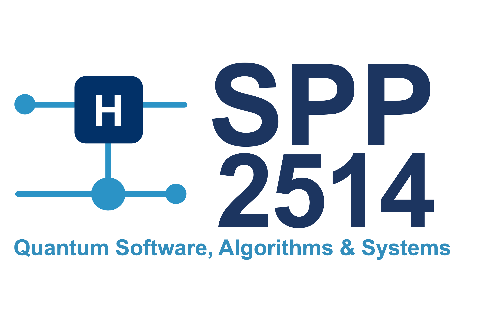

RydOpt - A Multiqubit Rydberg Gate Optimizer
============================================

[](http://rydopt.readthedocs.io)
[](https://github.com/dflocher/rydopt/actions/workflows/tests.yml)
[](https://pypi.org/project/rydopt/)

RydOpt is a Python package for the optimization of laser pulses implementing two- and multiqubit Rydberg gates
in neutral atom quantum computing platforms. The optimization methods support GPUs and multi-core CPUs, using an
efficient implementation based on JAX.

Install the software with pip (requires Python ≥ 3.10; for enabling GPU support and tips, see our [extended installation instructions](https://rydopt.readthedocs.io/en/latest/install.html)):

```bash
pip install rydopt
```

Documentation and Minimal Usage Example
---------------------------------------

The package documentation can be found at https://rydopt.readthedocs.io/.

To get an idea how the software is used, we provide in the following a minimal usage example.
The code optimizes a pulse to realize a CZ gate on two atoms in the perfect blockade regime.

```python
import rydopt as ro
import numpy as np

# Want to perform a CZ gate on two atoms in the perfect blockade regime; no Rydberg state decay
gate = ro.gates.TwoQubitGate(phi=None, theta=np.pi, Vnn=float("inf"), decay=0.0)

# Pulse ansatz: constant detuning, sweep of the laser phase according to a sine CRAB ansatz
pulse_ansatz = ro.pulses.PulseAnsatz(detuning_ansatz=ro.pulses.Const(), phase_ansatz=ro.pulses.SinCrab(2))

# Initial pulse parameter guess
initial_params = ro.pulses.PulseParams(duration=7.0, detuning_params=[0.0], phase_params=[0.0, 0.0])

# Optimize the pulse parameters
opt_result = ro.optimization.optimize(gate, pulse_ansatz, initial_params, tol=1e-10)
optimized_params = opt_result.params

# Plot the pulse
ro.characterization.plot_pulse(pulse_ansatz, optimized_params)
```

Citing RydOpt
-------------

If you find this library useful for your research, please cite:
> D.F. Locher, J. Old, K. Brechtelsbauer, J. Holschbach, H.P. Büchler, S. Weber, M. Müller,
*Multiqubit Rydberg Gates for Quantum Error Correction*, [PRX Quantum 7, 020354 (2026)](https://doi.org/10.1103/j8fm-24cf)

Contributors
------------

The following people have, so far, contributed to the development of RydOpt:

- [David Locher](https://github.com/dflocher)
- [Sebastian Weber](https://github.com/seweber)
- Jakob Holschbach
- [Javad Kazemi](https://github.com/jakazemi)

We warmly welcome new contributions! Please refer to the [contributor guide](https://rydopt.readthedocs.io/en/latest/contribute/development.html) for more information!

The development of RydOpt has been supported by [Forschungszentrum Jülich](https://www.fz-juelich.de/),
[RWTH Aachen University](https://www.rwth-aachen.de/), [University of Stuttgart](https://www.uni-stuttgart.de/), and the
company [ParityQC](https://parityqc.com/). We acknowledge support from the Federal Ministry of Research, Technology and Space (BMFTR) through the
grant [MUNIQC-Atoms](https://muniqc-atoms.munich-quantum-valley.de/) and from the German Research Foundation (DFG) through the priority
programme [SPP 2514](https://www.spp2514.kit.edu/).

[](https://muniqc-atoms.munich-quantum-valley.de/)
[](https://www.spp2514.kit.edu/)
[](https://parityqc.com/)

License
-------

The RydOpt software is licensed under the [MIT License](https://opensource.org/licenses/MIT).
