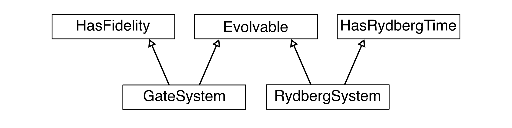

.. _protocols:

Protocols
=========

The protocols described here specify which methods a class must implement such that it can be used for a specific purpose.
The hierarchy of the provided protocols is shown in the following diagram.

.. automodule:: rydopt.protocols
   :members:
   :undoc-members:
